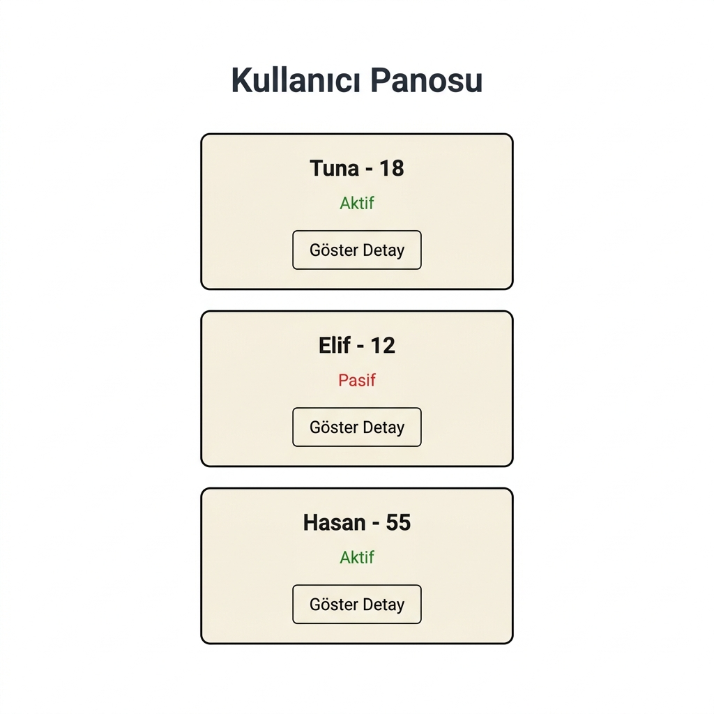
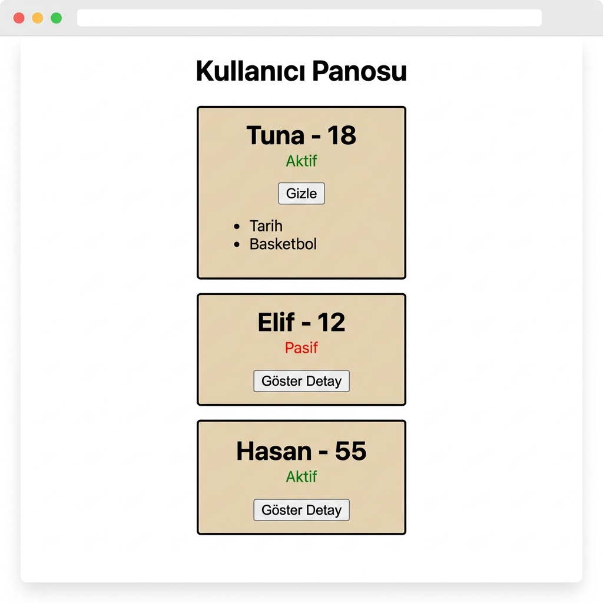
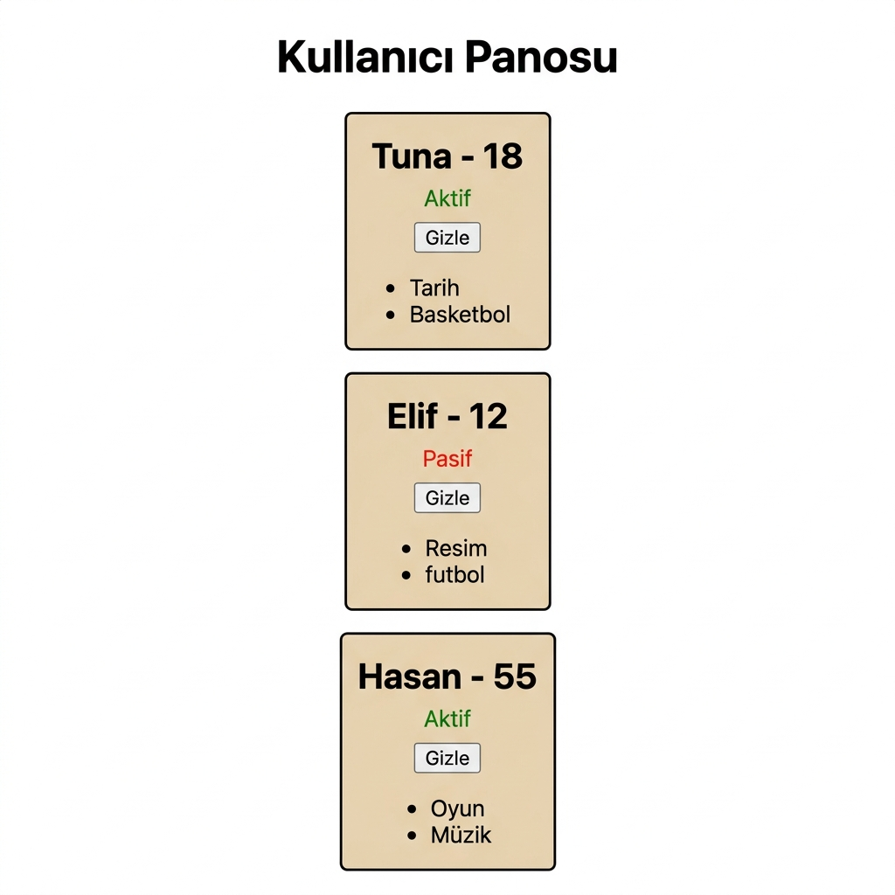

# React Props — Kullanici Panosu

React'te props kullanarak bileşenler arası veri aktarımını gösteren bir kullanıcı panosu. Her kullanıcı ayrı bir kart bileşeninde gösterilir; ad, yaş, aktiflik durumu ve hobiler gibi bilgiler parent bileşenden child bileşene props ile geçirilir. Kartlardaki butonla hobi listesi açılıp kapatılabilir.

---

## Ekran Goruntuleri

### Varsayilan Gorunum
Tum kartlar kapali halde. Her kartta kullanicinin adi, yasi ve aktiflik durumu gorunur.



### Tek Detay Acik
Tuna'nin kartindaki "Goster Detay" butonuna tiklanmis hali. Hobi listesi goruntulenir, diger kartlar kapali kalir.



### Tum Detaylar Acik
Uc kartın da detaylari acik. Her kullanicinin hobileri listelenmis durumda.



---

## Bilesen Yapisi

Proje 3 bileşenden oluşur. Veri akışı yukarıdan aşağıya doğru tek yönlüdür:

```
App
 └── KullaniciPanosu          (kullanıcı dizisini tanımlar, her eleman için KullaniciKart çağırır)
      ├── KullaniciKart       (Tuna)
      ├── KullaniciKart       (Elif)
      └── KullaniciKart       (Hasan)
```

**App** — Sayfa başlığını render eder, `KullaniciPanosu`'nu çağırır.

**KullaniciPanosu** — Kullanıcı verileri burada hardcode olarak tanımlıdır. `map()` ile her kullanıcı için bir `KullaniciKart` oluşturur ve `kullanici` objesini prop olarak geçirir.

**KullaniciKart** — Aldığı `kullanici` prop'unu destructure ederek kartı render eder. `useState` ile hobi listesinin açık/kapalı durumunu tutar. `aktif` değerine göre koşullu olarak yeşil "Aktif" veya kırmızı "Pasif" yazısı gösterir.

---

## Kullanilan React Kavramlari

| Kavram | Nerede | Ne Yapıyor |
|---|---|---|
| **Props** | `KullaniciPanosu → KullaniciKart` | `kullanici` objesi child bileşene aktarılıyor |
| **Destructuring** | `KullaniciKart({ kullanici })` | Props parametresi fonksiyon imzasında açılıyor |
| **useState** | `KullaniciKart` | `detayGoster` state'i hobi listesinin toggle'ını kontrol ediyor |
| **Kosullu render** | `KullaniciKart` | Ternary (`? :`) ile aktif/pasif metni, `&&` ile hobi listesi gösteriliyor |
| **map()** | `KullaniciPanosu`, `KullaniciKart` | Kullanıcı dizisi kartlara, hobi dizisi `<li>` elemanlarına dönüştürülüyor |
| **key** | `map()` içinde | React'in liste elemanlarını takip edebilmesi için index veriliyor |
| **Event handling** | `onClick` | Buton tıklamasında `setDetayGoster` çağrılıyor |

---

## Veri Yapisi

Her kullanıcı nesnesi şu alanlara sahiptir:

```js
{
  ad: string,        // kullanıcının adı
  yas: number,       // yaşı
  aktif: boolean,    // aktif mi pasif mi
  hobiler: string[]  // hobi listesi
}
```

Projede tanımlı veriler:

| Ad | Yas | Durum | Hobiler |
|---|---|---|---|
| Tuna | 18 | Aktif | Tarih, Basketbol |
| Elif | 12 | Pasif | Resim, Futbol |
| Hasan | 55 | Aktif | Oyun, Muzik |

---

## Proje Yapisi

```
React-Props/
├── public/
│   ├── index.html
│   ├── favicon.ico
│   ├── manifest.json
│   └── robots.txt
├── screenshots/
│   ├── varsayilan-gorunum.png
│   ├── detay-acik.png
│   └── tum-detaylar-acik.png
├── src/
│   ├── App.js                 # ana bileşen
│   ├── App.css
│   ├── KullaniciPanosu.js     # kullanıcı listesini yöneten bileşen
│   ├── KullaniciKart.js       # tek bir kartı render eden bileşen
│   ├── KullaniciKart.css      # kart stilleri
│   ├── index.js               # ReactDOM.createRoot ile uygulamayı DOM'a bağlar
│   └── index.css              # global stiller
├── package.json
├── .gitignore
└── README.md
```

---

## Kurulum

```bash
git clone https://github.com/Tuna-hero/React-Props.git
cd React-Props
npm install
npm start
```

Uygulama `http://localhost:3000` adresinde açılır.

| Komut | Aciklama |
|---|---|
| `npm start` | Geliştirme sunucusunu başlatır |
| `npm run build` | Production build oluşturur |
| `npm test` | Testleri çalıştırır |

---

## Teknolojiler

- React 19.1.0
- Create React App 5.0.1
- Vanilla CSS